# Ist meine Kaffeemaschine ein Computer?

--- 

# Ziele

Dieser Kurs soll die folgenden Fragen beantworten:

- Tag 1: Was ist ein Computer?
- Tag 2: Was ist das Internet?

---

# Was ist ein Computer?

- Was ist ein Computer?
- Computer-Architektur
- Daten-Kodierung
- Eingebettete Systeme (Embedded Devices)
- Was ist ein Algorithmus?

---

# Welches von diesen Geräten ist ein Computer?

- Notebook
- Smartphone
- Sprachassistenten (Alexa, HomePod, ...)
- Raspberry Pi
- Waschmaschine
- Kaffeemaschine
- Auto

---

# Was ist ein Computer?

## [Wikipedia](https://de.wikipedia.org/wiki/Computer)

> Ein Computer [...] ist ein Gerät, das mittels programmierbarer Rechenvorschriften Daten verarbeitet.

> Computer sind heute in allen Bereichen des täglichen Lebens vorzufinden, meistens in spezialisierten Varianten, die auf einen vorliegenden Anwendungszweck zugeschnitten sind. So dienen integrierte Kleinstcomputer [...] zur Steuerung von Alltagsgeräten wie Waschmaschinen [...]; in modernen Automobilen dienen sie [...] zur Anzeige von Fahrdaten und steuern in „Fahrassistenten“ diverse Manöver selbst.

---

# Was ist ein Computer?

Fast jedes moderne Gerät beinhaltet mindestens einen Computer in From eines integrierten Kleinstcomputer (Embedded Device)

## Computer-Architektur

Fast alle aktuellen Computer verwenden die [Von-Neumann-Architektur](https://de.wikipedia.org/wiki/Von-Neumann-Architektur)

- Idee: Programme und Daten werden im Speicher abgelegt

---

## Von-Neumann-Architektur

- CPU
    - Rechenwerk (ALU)
    - Steuerwerk (Control Unit)
- Bus System
    - Speicherwerk (RAM, Festplatte)
    - I/O Unit (Tastatur, Bildschirm)

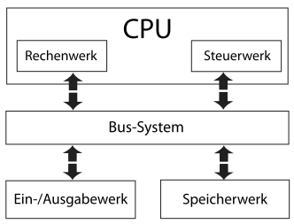

[Grafik: Wikipedia](https://de.wikipedia.org/wiki/Von-Neumann-Architektur#/media/Datei:Von-Neumann_Architektur.svg)

---


Central Processing Unit (CPU)
Intel Core i7, AMD Ryzen 9, ...
[Quelle: Wikimedia](https://commons.wikimedia.org/wiki/File:Intel_CPU_Core_i7_2600K_Sandy_Bridge_top.jpg)

---


Arbeitsspeicher (RAM)
Typische Größen: 8GB, 16GB
GB: Gigabyte
[Quelle: Wikimedia](https://upload.wikimedia.org/wikipedia/commons/thumb/4/48/DDR3L_laptop_RAM_4_GB.jpg/512px-DDR3L_laptop_RAM_4_GB.jpg)

---


Solid State Disk (SSD)
Typische Größen: 512GB, 1TB, 2TB
TB: Terrabyte (1000GB)
[Quelle: Wikimedia](https://upload.wikimedia.org/wikipedia/commons/a/ad/Ssd_960.jpg)

---

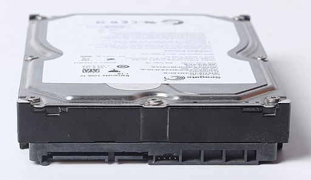

Hard Disk (HDD)
langsamer als SSDs, aber günstiger
Typische Größen: 1TB, 2TB, 4TB
[Quelle: Wikimedia](https://commons.wikimedia.org/wiki/File:3.5%22_hard_disk._SATA.jpg)

---

# Wie funktioniert ein Computer?

## Wsa ist ein Programm?

- lineare Liste von Befehlen
- auf dem persistenten Speicher (SSD, HDD) abgelegt
- verarbeiten Daten


[Grafik: Wikimedia](https://commons.wikimedia.org/wiki/File:Kochbuch_von_Bertha_Buch_Eins_Kapitel_00a.jpg)


---

# Wie funktioniert ein Computer?

## Wie wird ein Programm ausgeführt?

- Befehle werden ins RAM geladen
- CPU hat einen lokalen Status (Register, ...)
- Befehle können Daten und CPU Status ändern
- Befehle werden linear abgearbeitet
- Mit Sprungbefehlen können Entscheidungen und Schleifen realisiert werden
- einzelne Befehle haben eine geringe Komplexität (Rechnenoperationen, Vergleich, Sprünge)

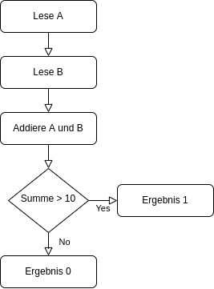

--- 

# Daten-Kodierung

## Binär

- heutige Computer kennen nur 0 und 1 (kein Strom, Strom)
- alle Daten und Programme müssen als 0 und 1 dargestellt werden

## Daten müssen Binär kodiert werden

- Nachricht (Syntax): Folge von 0en und 1en
- Information (Semantik): Bedeutung der Nachricht
- Daten: Nachricht + Information

--- 

# Daten Darstellung und Verarbeitung

- Programme
    - verarbeiten Daten (anzeigen, manipulieren)
    - interpretieren Daten
- die Darstellung von Daten in Programmen
    - ist auf einen bestimmten Anwendungsfall ausgerichtet
    - kann unvollständig sein

--- 

# Exkurs: Word Dokumente

- Word-Dokumente ([docx](https://www.ionos.de/digitalguide/online-marketing/verkaufen-im-internet/was-ist-eine-docx-datei/#:~:text=docx%2DDatei%20verh%C3%A4lt%20sich%20dabei,speichert%20und%20diese%20anschlie%C3%9Fend%20komprimiert.)) sind Zip-Dateien
- Experiment: docx in zip umbenennen
- Resultat: Ordnerstruktur mit xml, ...

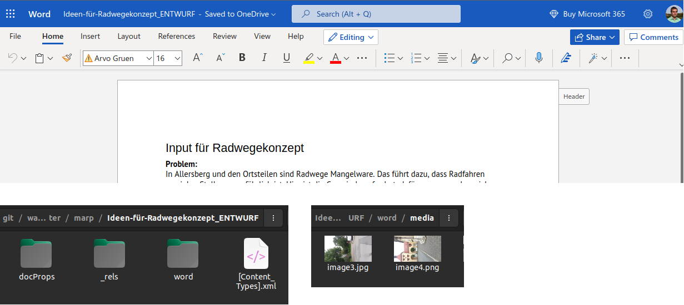

--- 

# Exkurs: Word Dokumente

- Dokumente können mehr beinhalten als auf den ersten Blick ersichtlich ist
- Word Dokumente beinhalten:
    - die Änderungshistorie
    - Metadaten (Author)

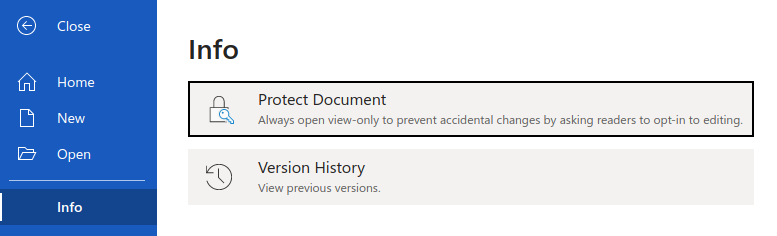

--- 

# Zahlensysteme

## [Dezimalsystem](https://de.wikipedia.org/wiki/Dezimalsystem)

- $123_{10} = 1 * 100 + 2 * 10 + 3 * 1$
- Wertigkeit der Stellen: $10^i$: $10^0=1$, $10^1=10$, $10^2=100$, ...

---

# Zahlensysteme

## [Dualsystem](https://de.wikipedia.org/wiki/Dualsystem)

- $101_2= 1 * 4 + 0 * 2 + 1 * 1 = 5_{10}$
- Wertigkeit der Stellen: $2^i$: $2^0=1$, $2^1=2$, $2^2=4$, $2^3=8$, ...

## [Hexadetimalsystem](https://de.wikipedia.org/wiki/Hexadezimalsystem)

- $10_{16} = 1 * 16 + 0 * 1 = 16_{10}$, $AF_{16}= 10 * 16 + 15 * 1 = 175_{10}$ 
- Wertigkeit der Stellen: $16^i$: $16^0=1$, $16^1=16$, $16^2=256$, ...

---

# Zahlensysteme

## Hexadezimaldarstellung von Binärdaten

- maximaler Wert einer 4-stelligen Binärzahl: $8+4+2+1=15$
- maximaler Wert einer 1-stelligen Hexadezimalzahl: $F_{16} = 15$
- 4 Zeichen binär ($XXXX_2$) = 1 Zeichen hexadezimal
- Binär-Daten lassen sich kompakt Hexadezimal darstellen:
    -  $1100_{2}=12_{10}=A_{16}$ 
    - $1100 0101_{2}$ = 1100 0101 = $A5_{16}$
    - 1 Byte = 8 Bit ($XX_{16}$, $XXXX.XXXX_{2}$)

--- 

# Zahlendarstellung im Computer

## [Zweierkomplement](https://de.wikipedia.org/wiki/Zweierkomplement)

- Zahlenraum: $-2^{n-1}, ... , 0, ... -2^{n-1}$
- 8bit: $-127...127$
- 32bit: $-4.294.967.295 ... 4.294. 967.295$
- Berechnung
    - Positive Zahlen: Binärdarstellung
    - Negative Zahlen: Binärdarstellung invertieren und 1 addieren
        - -4 = 0000 0100
        - invertiert: 1111 1011
        - 1 addieren: 1111 1100

---

## Gleitkommazahlen [IEEE 754](https://de.wikipedia.org/wiki/IEEE_754)

- Gleitkommazahlen (z.B. 3,14) müssen als Binärmuster darstellt werden
- Standard: IEEE 754:
    - $x=$ $s$ $m$ $2^e$
    - Vorzeichen $s$ (1 Bit)
    - Mantisse $m$ (p Bits)
    - Exponent $e$ (r Bits)
- 32 Bit Darstellung: $3,14=$ $0$ $2^1$ $1.5700000524520874$ $=$
0 1000.0000 100.1000.1111.0101.1100.0011
- Dargestellte Zahl: 3.1400001049041748046875
---

### [IEEE_754](https://de.wikipedia.org/wiki/IEEE_754)

Nicht alle Zahlen darstellbar. [Rundungsfehler](Rundungsfehler)! 


[Grafik: Wikimedia](https://upload.wikimedia.org/wikipedia/commons/8/8f/Exakt_darstellbare_Gleitkommazahlen.png)

---

# Texte im Computer

- Kodierung pro Zeichen
- einfachste Kodierung: [ASCII](https://en.wikipedia.org/wiki/ASCII)
    - ein Zeichen pro Byte, sehr kleiner Zeichenraum
- aktueller Standard: [UTF8](https://en.wikipedia.org/wiki/UTF-8)
    - variable Zeichenlänge, (fast) alle Zeichen darstellbar


---

## Exkurs: Zeichenkodierung

- Text: Hallo, Welt!
    - ASCII: 48 61 6c 6c 6f 2c 20 57 65 6c 74 21
    - UTF-8: 48 61 6c 6c 6f 2c 20 57 65 6c 74 21
    - UTF-16: 0048 0061 006c 006c 006f 002c 0020 0057 0065 006c 0074 0021
- Zeichen: ⻰
    - ASCII: Nicht darstellbar
    - UTF-8: e2 bb b0
    - UTF-16: 2ef0
- Was ist das dritte Zeichen in einem UTF-8 kodierten Text?

---

# Bilder im Computer

- Bilder werden als Pixel-Raster gespeichert
- eine Farbe pro Pixel
- verschiedene [Farbkodierungen](https://de.wikipedia.org/wiki/Farbraum), z.B. [RGBA](https://en.wikipedia.org/wiki/RGBA_color_model)
- einfachste Kodierung: [BMP](https://en.wikipedia.org/wiki/BMP_file_format)
- übliche Formate:
    - jpg (verlustbehaftet, Fotos)
    - png (verlustfrei, Internet)

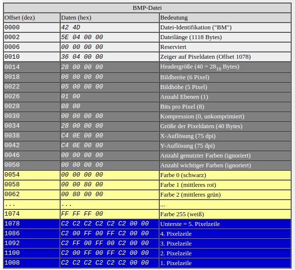

[Grafik: Pohlig.de](https://www.pohlig.de/Unterricht/Inf2004/Kap27/27.3_Das_bmp_Format.htm)

---

# Exkurs: Bilder

- Metadaten
```bash
...
    exif:DateTime: 2020:08:05 13:17:10
...
    exif:GPSLatitude: 49/1, 15/1, 3560/100
    exif:GPSLatitudeRef: N
    exif:GPSLongitude: 11/1, 13/1, 3996/100
    exif:GPSLongitudeRef: E
...
    exif:Model: iPhone 11
```

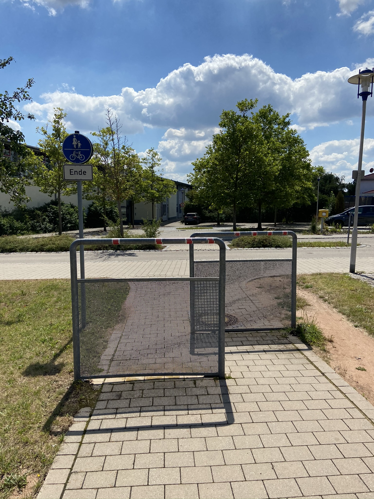

---

# Exkurs: Bilder

- Ort: N 49° 15' 35.60 E 11° 13' 39.96
- Aufnahmezeit: 05.08.2020 13:17:10
- Gerät: iPhone 11
- Jedes Foto-Posting ins Internet (Facebook, Strava, ..) verrät auch den genauen Standort

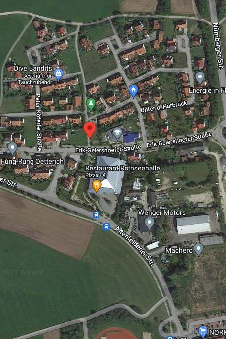

---

# Exkurs: PDF

- Google: site:vhs-roth.de filetype:PDF
- [Hygiene- und Präventionskonzept für vhs-Kurse](https://www.vhs-roth.de/fileadmin/user_upload/Hygienekonzept_vhs_LKR_Roth.pdf)
- Metadaten:

```bash
...
Author:          Zargaoui, Karin
Creator:         Acrobat PDFMaker 17 für Word
...
CreationDate:    Wed Aug 26 09:47:59 2020 CEST
```


--- 

# Was ist ein Algorithmus?

[Wikipedia](https://de.wikipedia.org/wiki/Algorithmus):

> Ein Algorithmus ist eine eindeutige Handlungsvorschrift zur Lösung eines Problems oder einer Klasse von Problemen. 

---

## Eigenschaften eines Algorithmus

- endlich beschreibbar (Finitheit)
- jeder Schritt muss (eindeutig) ausführbar sein (Ausführbarkeit)
- darf nur endlich viel Speicher verwenden (dynamische Finitheit)
- darf nur endlich viele Schritte benötigen (Terminierung)
- muss unter denselben Voraussetzungen das gleiche Ergebnis liefern (Determiniertheit)
- der nächste Schritt muss zu jedem Zeitpunkt eindeutig sein (Determinismus)

---

## Algorithmus in den Medien

- algorithmische Darstellung von Inhalten (z.B. Posts, Filme, ...)
- Darstellung wird auf bestimmte Ziele optimiert
    - Optimierung auf Unternehmensziel (nicht Benutzerziele)

---


---

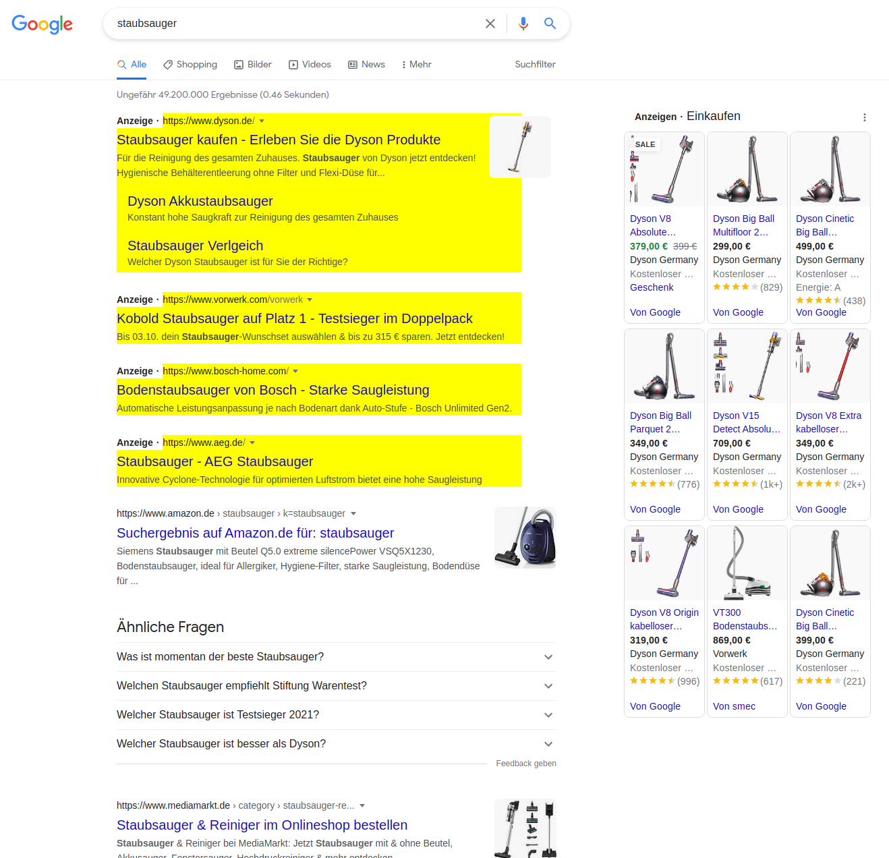

---

# [Eingebettetes System](https://de.wikipedia.org/wiki/Eingebettetes_System) (Embedded Device)

- (kompakter) (Einplatinen-) Computer
- Spezielle Aufgabe
- Eingabe sind häufig Sensoren (Temperatur, ..., Radar)
- Ausgabe sind häufig Aktoren (Motoren, ...)


[Grafik: Wikimedia](https://commons.wikimedia.org/wiki/File:Arduino_Uno_-_R3.jpg)

---

# Ist meine Kaffeemaschine ein Computer? Ja!

- Ein eingebettetes System steuert die mechanischen und elektrischen Komponenten, Sensoren (Temperatur, ...) sind die Eingabe
- Die Kaffee-Rezepte ist als Programme in einem eingebauten Speicher abgelegt


[Grafik: Wikimedia](https://commons.wikimedia.org/wiki/File:Kaffeevollautomat_ECAM_45.366.jpg)

---

# Smarte Geräte

- Vorteile:
    - benutzerfreundlicher
    - fortgeschrittene Funktionen
- Nachteile:
    - Geräte "im Internet" (WLAN) brauchen Updates
    - Smarte Geräte sind häufig "Backends" angewiesen

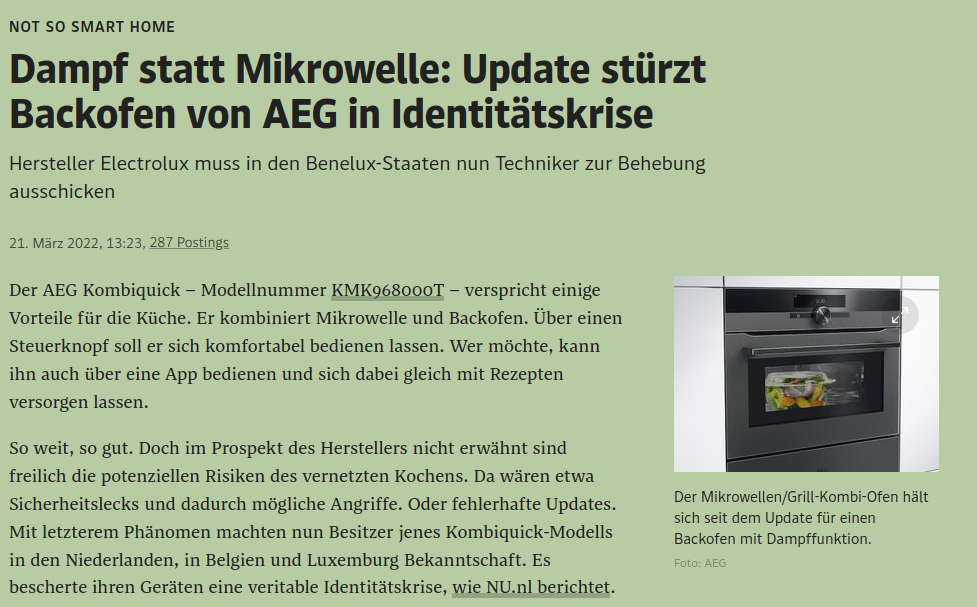

---


---

[Wikimedia: Fragen](https://commons.wikimedia.org/wiki/File:Fragen,_Wegweiser.JPG)
[Wikimedia: The End](https://commons.wikimedia.org/wiki/File:Imitationofchrist-end.png)


---


# Was ist das Internet?

- Was sind Computer-Netze?
- Wie funktioniert Verschlüsselung?
- Was ist Public Key Infrastruktur?
- Was ist die Cloud?
- Was ist ein Hacker Angriff?

---

# Was sind Computer-Netze?

[Wikipedia](https://de.wikipedia.org/wiki/Rechnernetz)

> Ein [...] Computernetzwerk ist ein Zusammenschluss verschiedener [...] primär selbstständiger elektronischer Systeme [...], der die Kommunikation der einzelnen Systeme untereinander ermöglicht. Ziel ist hierbei z. B. die gemeinsame Nutzung von Ressourcen wie Netzwerkdruckern, Servern, Dateien und Datenbanken. [...] Besondere Bedeutung hat heute auch die direkte Kommunikation zwischen den Netzwerknutzern (Chat, VoIP-Telefonie etc.).

---

## Client-Server Architektur

[Wikipedia](https://de.wikipedia.org/wiki/Client-Server-Modell)

> Das Client-Server-Modell [...] beschreibt eine Möglichkeit, Aufgaben und Dienstleistungen innerhalb eines Netzwerkes zu verteilen. [...] Der Client kann auf Wunsch einen Dienst vom Server anfordern [...]. Der Server [...] beantwortet die Anforderung [...]; üblicherweise kann ein Server gleichzeitig für mehrere Clients arbeiten.

[Grafik: Wikipedia (Mauro Bieg)](https://de.wikipedia.org/wiki/Client-Server-Modell#/media/Datei:Server-based-network.svg)


---

## Internet

[Wikipedia](https://de.wikipedia.org/wiki/Internet)

> Das Internet [...] ist ein weltweiter Verbund von Rechnernetzwerken [...]. Es ermöglicht die Nutzung von Internetdiensten wie WWW, E-Mail, [...] Der Datenaustausch zwischen den über das Internet verbundenen Rechnern erfolgt über die technisch normierten Internetprotokolle.

---

## HTML

[Wikipedia](https://de.wikipedia.org/wiki/Hypertext_Markup_Language)

> Die Hypertext Markup Language [...] ist eine textbasierte Auszeichnungssprache zur Strukturierung elektronischer Dokumente [...]. HTML-Dokumente sind die Grundlage des World Wide Web und werden von Webbrowsern dargestellt.

- statische Beschreibung der Inhalte
- wird vom Web-Server ausgeliefert und vom Browser dargestellt

[Grafik: Wikipedia](https://de.wikipedia.org/wiki/Hypertext_Markup_Language#/media/Datei:HTML.svg)

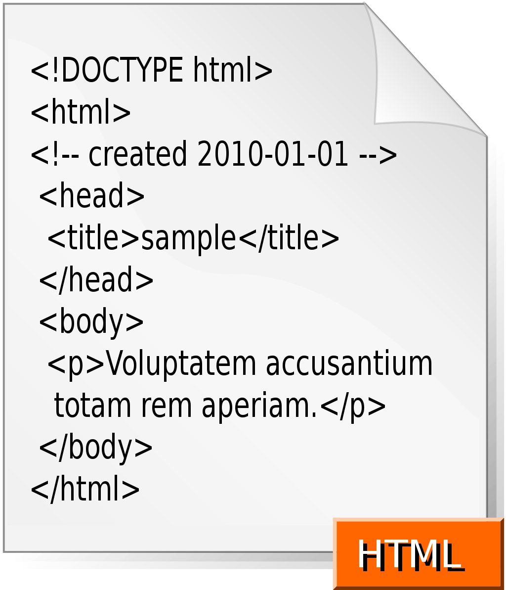

---

##  JavaScript

[Wikipedia](https://de.wikipedia.org/wiki/JavaScript)

> JavaScript [...] ist eine Skriptsprache, die ursprünglich [...] für dynamisches HTML in Webbrowsern entwickelt wurde, um Benutzerinteraktionen auszuwerten, Inhalte zu verändern, nachzuladen oder zu generieren und so die Möglichkeiten von HTML zu erweitern.

- dynamische Inhalte
- Programm das vom Server geladen und vom Browser ausgeführt wird

[Grafik: Wikipedia](https://de.wikipedia.org/wiki/JavaScript)

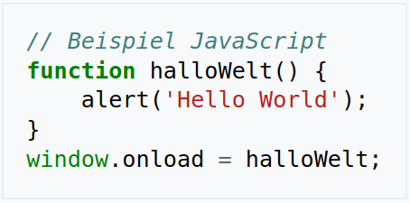

---

## Exkurs: MonkeyScript

- JavaScript wird vom Browser ausgeführt
- Benutzer kann JavaScript manipulieren
- Änderung ist nur "lokal" (auf dem eigenen Rechner) sichtbar
- Tampermonkey/Greasemonkey erlaubt eigene Skripts "hinzuzufügen"


---

# Wie funktioniert Verschlüsselung?

- Bob will Alice eine Nachricht schicken
- Malloy will die Nachricht lesen
- Bob und Alice haben ein gemeinsames Passwort
- Algorithmus ist öffentlich, Passwort ist geheim


---

## Transport Layer Security (TLS/SSL)

[Wikipedia](https://de.wikipedia.org/wiki/Transport_Layer_Security)

> Transport Layer Security [...], auch bekannt unter der Vorgängerbezeichnung Secure Sockets Layer (SSL), ist ein Verschlüsselungsprotokoll zur sicheren Datenübertragung im Internet.

- Daten vom Client zum Server werden verschlüsselt
- Metadaten (wer kommuniziert wann mit wem) sind nicht verschlüsselt 

---

## Exkurs: [eMail](https://de.wikipedia.org/wiki/E-Mail)

- Inhalte sind unverschlüsselt
    - [S/MIME](https://de.wikipedia.org/wiki/S/MIME) / [PGP/MIME](https://de.wikipedia.org/wiki/PGP/MIME) sind Erweiterungen um den Inhalt zu verschlüsseln
- der Absender kann leicht "gefälscht" werden
- [SMTP](https://de.wikipedia.org/wiki/Simple_Mail_Transfer_Protocol): senden von eMails
- [POP3](https://de.wikipedia.org/wiki/Post_Office_Protocol)/[IMAP](https://de.wikipedia.org/wiki/Internet_Message_Access_Protocol): empfangen von eMails

[Grafik: Elektronik Kompendium](https://www.elektronik-kompendium.de/sites/net/0903081.htm)


---

##  [Ende-zu-Ende-Verschlüsselung](https://de.wikipedia.org/wiki/Ende-zu-Ende-Verschl%C3%BCsselung)

- ohne Ende-zu-Ende-Verschlüsselung:
    - TLS schützt nur auf dem Transportweg
    - jeder Server kann die Inhalte lesen/manipulieren
- Ende-zu-Ende-Verschlüsselung:
    - Inhalte sind geschützt
    - Metadaten (wer kommuniziert wann mit wem) ist "öffentlich"

---

# Exkurs: Metadaten

[Bundesamt für Sicherheit in der Informationstechnik (BSI)](https://www.bsi.bund.de/DE/Themen/Verbraucherinnen-und-Verbraucher/Informationen-und-Empfehlungen/Onlinekommunikation/Chat-Messenger/Messenger/messenger_node.html#:~:text=Nachrichten%2C%20die%20%C3%BCber%20Messenger%20verschickt,das%20Datum%20und%20die%20Uhrzeit.):

> Nachrichten, die über Messenger verschickt werden, bestehen aus dem Text der Nachricht [...] und sogenannten Metadaten. Zu den Metadaten zählen die Kennung des Absenders, häufig in der Form der Telefonnummer, die Kennung des Adressaten, das Datum und die Uhrzeit.  [...] Solche Daten dienen nicht nur der korrekten Zuleitung der Nachricht, sondern können auch zur Analyse von Vorlieben und ähnlichem genutzt werden. Auf diese Weise lassen sich Profile erstellen, die für personalisierte Werbung genutzt werden können.

- [SpiegelMining](https://media.ccc.de/v/33c3-7912-spiegelmining_reverse_engineering_von_spiegel-online) zeigt was mit Metadaten möglich ist

---

# Was ist Public Key Infrastruktur?

[Wikipedia](https://de.wikipedia.org/wiki/Public-Key-Infrastruktur):

> Mit Public-Key-Infrastruktur [...] bezeichnet man in der Kryptologie ein System, das digitale Zertifikate ausstellen, verteilen und prüfen kann. Die innerhalb einer PKI ausgestellten Zertifikate werden zur Absicherung rechnergestützter Kommunikation verwendet.

- basiert auf [asymmetrischer Verschlüsselung](https://de.wikipedia.org/wiki/Asymmetrisches_Kryptosystem)
- Anwendungen: HTTPS, Corona Impfzertifikate

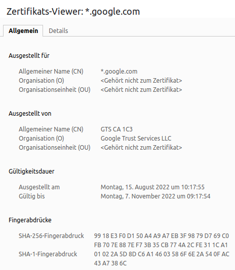

---

# Was ist die Cloud?

[Wikipedia](https://de.wikipedia.org/wiki/Cloud_Computing):

> Cloud Computing [...] beschreibt ein Modell, das bei Bedarf [...] zeitnah und mit wenig Aufwand geteilte Computerressourcen als Dienstleistung [...] bereitstellt und nach Nutzung abrechnet.

- ohne Verschlüsselung hat der Cloud-Anbieter Datenzugriff

[Grafik: Wikipedia](https://de.wikipedia.org/wiki/Cloud_Computing#/media/Datei:Cloud_computing.svg)

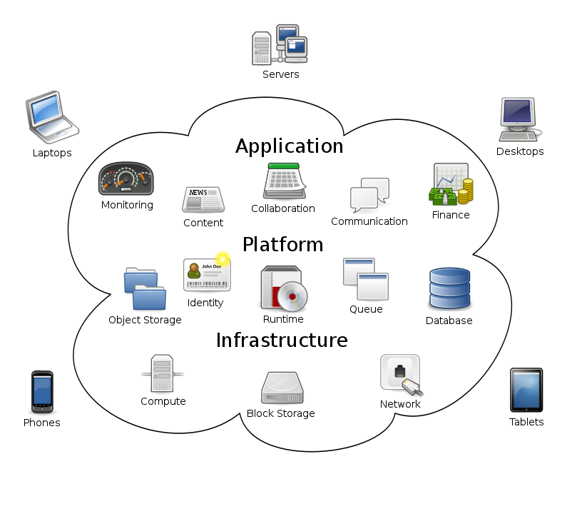

---

# Was ist ein [Hacker](https://de.wikipedia.org/wiki/Hacker_(Computersicherheit))-Angriff?

[Wikipedia: Black-Hat](https://de.wikipedia.org/wiki/Hacker_(Computersicherheit)#Black-Hats)

> Black-Hats [...] handeln mit krimineller Energie [...] und beabsichtigen [...] das Zielsystem zu beschädigen oder Daten zu stehlen[...].

- kriminelle oder staatliche motivierte Manipulation von fremden Computern
- Angriffswege:
    - Benutzer ([Phishing](https://de.wikipedia.org/wiki/Phishing), [Social Engineering](https://de.wikipedia.org/wiki/Social_Engineering_(Sicherheit)))
    - schlechte Konfiguration (Standard-Passwörter)
    - Softwarefehler ([CVE](https://de.wikipedia.org/wiki/Common_Vulnerabilities_and_Exposures))

---

# Wie funktioniert ein Hacker-Angriff?

- Zugriff erlangen über einen Angriffsweg
- Zugriff sicher - "unsichtbar" für das Opfer
- Zugriff ausweiten - andere Geräte im Netzwerk
- Profit erzielen:
    - Daten stehlen und verkaufen (Kreditkarten, Firmengeheimnisse, ...)
    - Ransomware
- Selten: [DoS](https://de.wikipedia.org/wiki/Denial_of_Service) ("digitaler Sitzstreik") - Dienst wird durch Überlastung für Benutzer nicht mehr erreichbar 


---

## [Ransomware](https://de.wikipedia.org/wiki/Ransomware) 

- Erpressungssoftware
- Daten werden verschlüsselt
- Unternehmen: Daten werden gestohlen

[Grafik: Wikipedia](https://de.wikipedia.org/wiki/Ransomware#/media/Datei:%EA%B0%90%EC%97%BC%EC%82%AC%EC%A7%84.png)

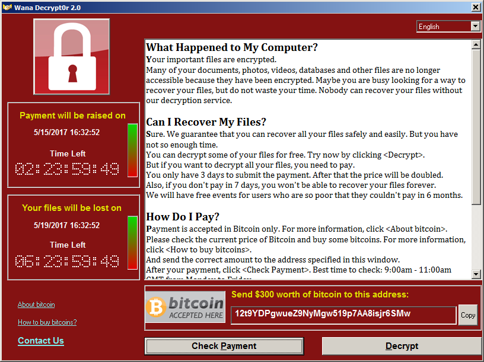

---

# Ist mein Auto ein Computer? Ja!

- ECU: "electonic control unit" - eingebettetes System
- ECUs bilden ein Computer-Netzwerk - Kommunikation über CAN/LIN/FlexRay/Ethernet
- bisherige Fahrzeuge beinhalten ein Netzwerk von bis zu mehr als hundert ECUs
- moderne Fahrzeuge setzen auf mehreren HPCs (High Performance Computer) mit virtuelle Maschinen (Linux, QNX) die mit Gigabit-Ethernet Netzwerken kommunizieren

---


---

[Wikimedia: Fragen](https://commons.wikimedia.org/wiki/File:Fragen,_Wegweiser.JPG)
[Wikimedia: The End](https://commons.wikimedia.org/wiki/File:Imitationofchrist-end.png)

