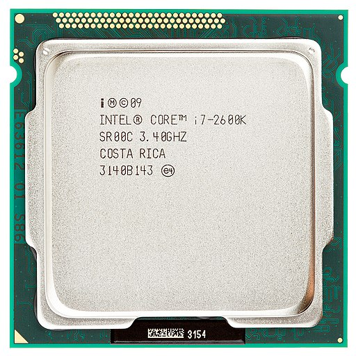
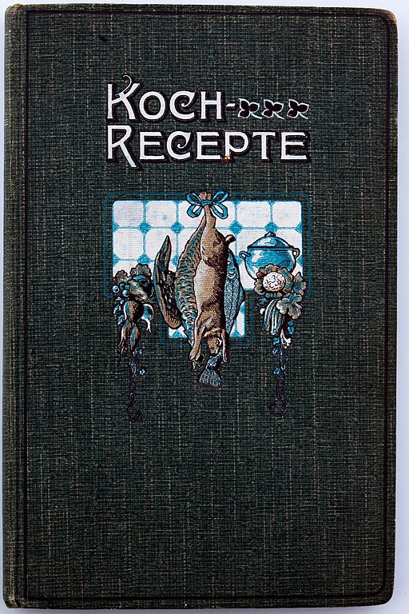
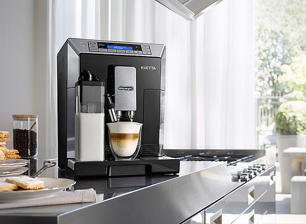

# Ist meine Kaffeemaschine ein Computer?

--- 

# Ziele

Dieser Kurs soll die folgenden Fragen beantworten:

- Tag 1: Was ist ein Computer?
- Tag 2: Was ist das Internet?

---

# Was ist ein Computer?

- Was sind Computer?
- Computer-Architektur
- Daten-Kodierung
- Embedded Devices

---

# Welches von diesen Geräten ist ein Computer?

- PC  / Notebook
- Smartphone
- Sprachassistenten (Alexa, HomePod, ...)
- Raspberry Pi
- Waschmaschine
- Kaffeemaschine
- Auto

---

# Computer

## [Wikipedia](https://de.wikipedia.org/wiki/Computer)

> Ein Computer [...] ist ein Gerät, das mittels programmierbarer Rechenvorschriften Daten verarbeitet.

> Computer sind heute in allen Bereichen des täglichen Lebens vorzufinden, meistens in spezialisierten Varianten, die auf einen vorliegenden Anwendungszweck zugeschnitten sind. So dienen integrierte Kleinstcomputer [...] zur Steuerung von Alltagsgeräten wie Waschmaschinen [...]; in modernen Automobilen dienen sie [...] zur Anzeige von Fahrdaten und steuern in „Fahrassistenten“ diverse Manöver selbst.

---

# Computer

Fast jedes moderne Gerät beinhaltet mindestens einen Computer in From eines integrierten Kleinstcomputer (Embedded Device)

---

# Computer-Architektur

Fast alle aktuellen Computer verwenden die [Von-Neumann-Architektur](https://de.wikipedia.org/wiki/Von-Neumann-Architektur)

- Programme und Daten werden im Speicher abgelegt

---

# Von-Neumann-Architektur

- CPU
    - Rechenwerk (ALU)
    - Steuerwerk (Control Unit)
- Bus System
    - Speicherwerk (RAM, Festplatte)
    - I/O Unit (Tastatur, Bildschirm)

[Grafik: Wikipedia](https://de.wikipedia.org/wiki/Von-Neumann-Architektur#/media/Datei:Von-Neumann_Architektur.svg)

---

Central Processing Unit (CPU)
Intel Core i7, AMD Ryzen 9, ...
[Quelle: Wikimedia](https://commons.wikimedia.org/wiki/File:Intel_CPU_Core_i7_2600K_Sandy_Bridge_top.jpg)

---

Arbeitsspeicher (RAM)
Typische Größen: 8GB, 16GB
GB: Gigabyte
[Quelle: Wikimedia](https://upload.wikimedia.org/wikipedia/commons/thumb/4/48/DDR3L_laptop_RAM_4_GB.jpg/512px-DDR3L_laptop_RAM_4_GB.jpg)

---

Solid State Disk (SSD)
Typische Größen: 512GB, 1TB, 2TB
TB: Terrabyte (1000GB)
[Quelle: Wikimedia](https://upload.wikimedia.org/wikipedia/commons/a/ad/Ssd_960.jpg)

---

Hard Disk (HDD)
Typische Größen: 1TB, 2TB, 4TB
[Quelle: Wikimedia](https://commons.wikimedia.org/wiki/File:3.5%22_hard_disk._SATA.jpg)

---

# Wie funktioniert ein Computer?

## Programm

- lineare Liste von Befehlen
- auf dem persistenten Speicher (SSD, HDD) abgelegt

[Grafik: Wikimedia](https://commons.wikimedia.org/wiki/File:Kochbuch_von_Bertha_Buch_Eins_Kapitel_00a.jpg)

---

# Wie funktioniert ein Computer?

## Ausführung

- Befehle werden in den RAM geladen
- CPU hat lokalen Status (Register, Caches, ...)
- Befehle können Daten (RAM, SSD, HDD) und CPU Status ändern
- Befehle werden linear abgearbeitet (Ausnahme: Sprungbefehle)
- Befehle: Rechnen, Vergleich, Sprünge

--- 

# Daten-Kodierung

## Binär

- Computer können nur 0 und 1 (kein Strom, Strom) unterscheiden
- Alle Daten und Programme müssen als 0 und 1 dargestellt werden

## Kodierung

- Nachricht (Syntax): Folge von 0en und 1en
- Information (Semantik): Bedeutung der Nachricht
- Daten: Nachricht + Information
- Wissen (Pragmatik): Interpretation der Daten, Anwendung von Regeln

--- 

# Zahlensysteme

## [Dezimalsystem](https://de.wikipedia.org/wiki/Dezimalsystem)

- $123 = 1 * 100 + 2 * 10 + 3 * 1$
- Wertigkeit der Stellen: $10^i$: $10^0=1$, $10^1=10$, $10^2=100$, ...

## [Dualsystem](https://de.wikipedia.org/wiki/Dualsystem)

- $101_2= 1 * 4 + 0 * 2 + 1 * 1 = 5_{10}$
- Wertigkeit der Stellen: $2^i$: $2^0=1$, $2^1=2$, $2^2=4$, $2^3=8$, ...

--- 

## [Hexadetimalsystem](https://de.wikipedia.org/wiki/Hexadezimalsystem)

- $10_{16} = 1 * 16 + 0 * 1 = 16_{10}$, $AF_{16}= 10 * 16 + 15 * 1 = 175_{10}$ 
- Wertigkeit der Stellen: $16^i$: $16^0=1$, $16^1=16$, $16^2=256$, ...

## Binär $<->$ Hexadezimal

- 4 Zeichen binär ($XXXX_2$) = 1 Zeichen hexadezimal
-  $1100_{2}=12_{10}=A_{16}$ 
- $1100 0101_{2}$ = 1100 0101 = $A5_{16}$
- 1 Byte = 8 Bit ($XX_{16}$, $XXXX.XXXX_{2}$)

--- 

# Zahlendarstellung im Computer

## [Zweierkomplement](https://de.wikipedia.org/wiki/Zweierkomplement)

- Zahlenraum: $-2^{n-1}, ... , 0, ... -2^{n-1}$
- 32bit: -4.294.967.295 ... 4.294. 967.295
- Positive Zahlen: Binär
- Negative Zahlen: Binär, invertieren, +1
- -4 = 0000 0100, invert: 1111 1011, +1: 1111 1100

---

## Gleitkommazahlen [IEEE_754](https://de.wikipedia.org/wiki/IEEE_754)

- $x=s*m*b^e$
- Vorzeichen $s$ (1 Bit)
- Mantisse $m$ (p Bits)
- Basis $b$ ($b=2$)
- Exponent $e$ (r Bits)

---

### [IEEE_754](https://de.wikipedia.org/wiki/IEEE_754)

Nicht alle Zahlen darstellbar. [Rundungsfehler](Rundungsfehler)! 

[Grafik: Wikimedia](https://upload.wikimedia.org/wikipedia/commons/8/8f/Exakt_darstellbare_Gleitkommazahlen.png)

---

# Texte im Computer

- Kodierung pro Zeichen
- einfachste Kodierung: [ASCII](https://en.wikipedia.org/wiki/ASCII)
    - ein Zeichen pro Byte, sehr kleiner Zeichenraum
- aktueller Standard: [UTF8](https://en.wikipedia.org/wiki/UTF-8)
    - variable Zeichenlänge, (fast) alle Zeichen darstellbar

---

# Bilder im Computer

- Pixel-Raster, Farbe pro Pixel, z.B. [RGBA](https://en.wikipedia.org/wiki/RGBA_color_model)
- einfachste Kodierung: [BMP](https://en.wikipedia.org/wiki/BMP_file_format)
- Komprimierung: verlustbehaftet (z.B. jpg), verlustfrei (z.B. png)

--- 

# [Eingebettetes System](https://de.wikipedia.org/wiki/Eingebettetes_System) (Embedded Device)

- (kompakter) (Einplatinen-) Computer
- Spezielle Aufgabe
- Eingabe sind häufig Sensoren (Temperatur, ..., Radar)
- Ausgabe sind häufig Aktoren (Motoren, ...)

[Grafik: Wikimedia](https://commons.wikimedia.org/wiki/File:Arduino_Uno_-_R3.jpg)

---

# Ist meine Kaffeemaschine ein Computer? Ja!

- Ein eingebettetes System steuert die mechanischen und elektrischen Komponenten, Sensoren (Temperatur, ...) sind die Eingabe
- Die Kaffee-Rezepte ist als Programme in einem eingebauten Speicher abgelegt
- Vorsicht:
    - Geräte "im Internet" (WLAN) brauchen Updates
    - Geräte "mit Internet" brauchen häufig "Backends", stellt der Hersteller sie ein sind die nutzlos

[Grafik: Wikimedia](https://commons.wikimedia.org/wiki/File:Kaffeevollautomat_ECAM_45.366.jpg)

---

---

[Wikimedia: Fragen](https://commons.wikimedia.org/wiki/File:Fragen,_Wegweiser.JPG)
[Wikimedia: The End](https://commons.wikimedia.org/wiki/File:Imitationofchrist-end.png)

---

# Was ist das Internet?

- Was ist ein Algorithmus?
- Computer-Netze
- Client-Server Architektur
- HTML & JavaScript

--- 

# Was ist ein Algorithmus?

[Wikipedia](https://de.wikipedia.org/wiki/Algorithmus):

> Ein Algorithmus ist eine eindeutige Handlungsvorschrift zur Lösung eines Problems oder einer Klasse von Problemen. 

---

## Informatik: Algorithmus

- Endlich beschreibbar (Finitheit)
- Jeder Schritt muss (eindeutig) ausführbar sein (Ausführbarkeit)
- Darf nur endlich viel Speicher verwenden (dynamische Finitheit)
- Darf nur endlich viele Schritte benötigen (Terminierung)
- Muss unter denselben Voraussetzungen das gleiche Ergebnis liefern (Determiniertheit)
- Der nächste Schritt ist zu jedem Zeitpunkt eindeutig (Determinismus)

---

## Was ist der Facebook/Twitter-Algorithmus?

- "algorithmische Darstellung der Timeline"
- Nachrichtendarstellung ist auf die Unternehmensziele optimiert
    - Nachrichten werden nicht zeitlich sortiert
    - es werden nicht alle Nachrichten dargestellt
    - Nutzer soll möglichst lange auf der Platform bleiben (Werbung)
    - Unternehmensziele sind häufig nicht im Sinne des Benutzers

---

# Computer-Netze

---

# Client-Server Architektur

---

# HTML & JavaScript
